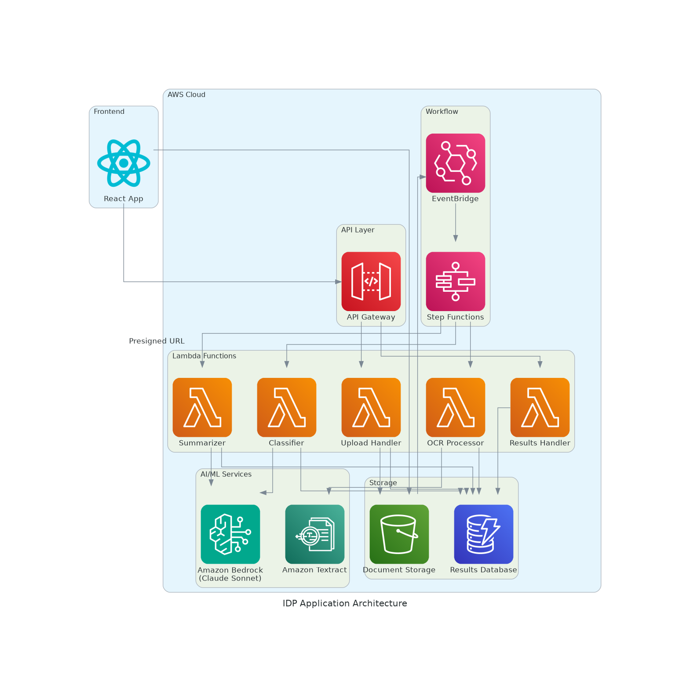

# Intelligent Document Processing (IDP) Application

A serverless document processing application built with AWS CDK that performs OCR, classification, and summarization on uploaded documents.

## Architecture



## Features

- **Document Upload**: Simple web interface for uploading documents
- **OCR Processing**: Extract text from images and PDFs using Amazon Textract
- **Document Classification**: Classify documents into 8 categories using Amazon Bedrock
- **Document Summarization**: Generate concise summaries using Amazon Bedrock
- **Real-time Results**: View processing results in real-time through the web interface

## Supported Document Categories

- Dietary Supplement
- Stationery
- Kitchen Supplies
- Medicine
- Driver License
- Invoice
- W2
- Other

## Technology Stack

### Backend
- **AWS CDK**: Infrastructure as Code
- **Amazon S3**: Document storage
- **Amazon DynamoDB**: Results storage (Provisioned billing mode)
- **AWS Lambda**: Serverless compute
- **Amazon API Gateway**: REST API endpoints
- **Amazon Textract**: OCR text extraction
- **Amazon Bedrock**: Claude Sonnet model for classification and summarization
- **Amazon EventBridge**: Event-driven processing triggers

### Frontend
- **React**: User interface framework
- **TypeScript**: Type-safe JavaScript
- **AWS SDK**: AWS service integration

## Project Structure

```
idp-app-100420251116/
├── specs/                          # Specification documents
│   ├── requirements.md             # User stories and acceptance criteria
│   ├── design.md                   # Technical architecture
│   └── tasks.md                    # Implementation plan
├── cdk-app/                        # AWS CDK application
│   ├── lib/                        # CDK stack definitions
│   ├── lambda-functions/           # Lambda function code
│   └── bin/                        # CDK app entry point
├── frontend/                       # React frontend application
├── generated-diagrams/             # Architecture diagrams
├── test-frontend.html              # Simple HTML test interface
├── validate-system.sh              # System validation script
└── VitaminTabs.jpeg               # Sample test image
```

## Deployment

### Prerequisites
- AWS CLI configured with appropriate permissions
- Node.js 18+ installed
- CDK CLI installed (`npm install -g aws-cdk`)

### Deploy Backend
```bash
cd cdk-app
npm install
npm run build
npx cdk deploy --require-approval never
```

### Run Frontend
```bash
cd frontend
npm install
npm start
```

## API Endpoints

- **POST /upload**: Generate presigned URL for document upload
- **GET /results/{documentId}**: Retrieve processing results

## Usage

1. **Upload Document**: Select and upload an image or PDF file
2. **Processing**: The system automatically processes the document through:
   - OCR text extraction
   - Document classification
   - Summary generation
3. **View Results**: See extracted text, classification, and summary in real-time

## Testing

### Automated Validation
```bash
./validate-system.sh
```

### Manual Testing
1. Open `test-frontend.html` in your browser
2. Upload the sample `VitaminTabs.jpeg` image
3. Observe the processing pipeline and results

### Expected Results for Sample Image
- **Classification**: Dietary Supplement (98% confidence)
- **OCR Text**: "value pack amazon basics vitamin C 250 mg per serving..."
- **Summary**: Comprehensive summary with key points about the vitamin supplement

## Monitoring

- **CloudWatch Logs**: Centralized logging for all Lambda functions
- **API Gateway Metrics**: Request/response monitoring
- **DynamoDB Metrics**: Database performance monitoring

## Security Features

- **IAM Roles**: Least privilege access for Lambda functions
- **S3 Presigned URLs**: Secure direct uploads to S3
- **CORS Configuration**: Proper cross-origin resource sharing
- **Encryption**: DynamoDB encryption at rest

## Cost Optimization

- **Provisioned DynamoDB**: Consistent performance for database operations
- **Event-driven Architecture**: Pay-per-use Lambda execution
- **S3 Lifecycle Policies**: Automatic cleanup of old documents

## Troubleshooting

### Common Issues
1. **Upload Failures**: Check CORS configuration and presigned URL expiration
2. **Processing Errors**: Review CloudWatch logs for Lambda functions
3. **Classification Issues**: Verify Bedrock model access permissions

### Validation Commands
```bash
# Test API endpoints
curl -X POST https://your-api-endpoint/upload -H "Content-Type: application/json" -d '{"fileName": "test.jpg"}'

# Check S3 bucket
aws s3 ls s3://idp-documents-100420251116

# Verify DynamoDB table
aws dynamodb scan --table-name idp-results-100420251116 --select COUNT
```

## Development

### Specification-Driven Development
This project follows a specification-driven approach with:
- **Requirements**: User stories in EARS notation
- **Design**: Technical architecture documentation
- **Tasks**: Detailed implementation plan

### Code Quality
- TypeScript for type safety
- Minimal code approach focusing on essential functionality
- Error handling and logging throughout the pipeline

## License

This project is created as a prototype for demonstration purposes.

## Support

For issues or questions, refer to the validation script output and CloudWatch logs for debugging information.
